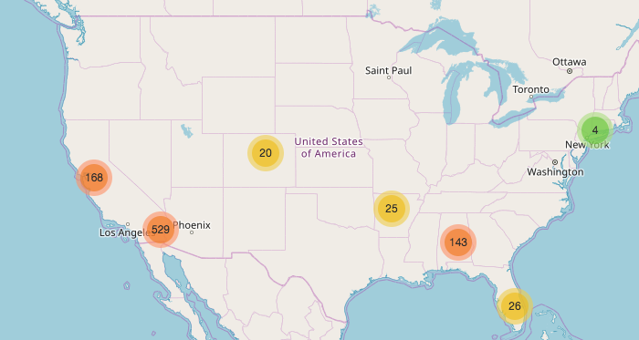

# wingstop-map

## Prerequisites

```
$: brew install python3

$: pip3 install virtualenv

$: git clone git@github.com:darrylbalderas/wingstop-map.git

$: cd wingstop-map

$: python3 -m venv ./venv

$: source venv/bin/activate  

$: pip install -r requirements.txt
```


Use Beautiful Soup to extract location information from [Wingstop website]('https://order.wingstop.com/locations')

Use this [Google Maps Public api](https://maps.googleapis.com/maps/api/geocode/json?address=) to get latitude and longitude from wingstop addresses that I got using beautiful soup. It is free but limited to a few hundred http calls for the day.

Use Folium python module to produce this beautiful map down below:



If you notice that not all the locations are plotted because I was not able to get all of the latitude and longitude for all of the wingstop locations due to the limitations of google's public api.
